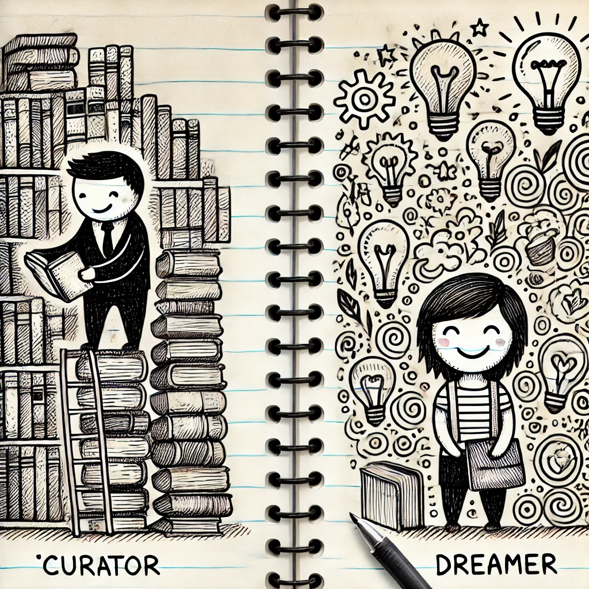

# SELMA <small>Search Engine and Language Model Animations</small>

Questo repository contiene il materiale presentato il 3 marzo 2025 presso
l'[Istituto di Istruzione Speriore Cremona](https://www.iiscremona.edu.it/).

È possibile accedere ad una [copia online delle slide](https://mapio.github.io/selma/), 
oppure, una volta installate le dipendenze descritte in [requirements.txt](/requirements.txt), 
scaricare questo repository ed utilzzare la libreria [selma](/selma/) per sperimentare 
come mostrato nel [playground](/Playground.ipynb).

## Il curatore e il sognatore 

  

Usiamo ogni giorno motori di ricerca come **Google** per trovare informazioni e
stiamo iniziando a esplorare strumenti basati sull'Intelligenza Artificiale come
**ChatGPT**. Sembrano magici, ma **come funzionano davvero**? C'è la differenza
tra un *curatore* che raccoglie e organizza una biblioteca e un *sognatore* che,
ispirato da quei libri, prova a immaginarne uno nuovo?

Attraverso una accattivante introduzione a concetti come i *grafi* e le *catene
di Markov*, lo studio di *algoritmi e strutture dati*, questa presentazione
illustrerà i principi di funzionamento di *m*otori di ricerca* e *modelli
generativi del linguaggio* cogliendo l'occasione per mostrare gli aspetti meno
noti, ma forse più affascinanti, dell'*informatica*.

Senza capire come funziona uno strumento complesso, si rischia di poterne fare
solo un uso acritico e passivo. Nel caso dei motori di ricerca e dell'AI questo
incontro vi aiuterà a **porre le domande giuste** e avere aspettative
plausibili, così come a **valutare l'affidabilità e veridicità delle risposte
ottenute**.